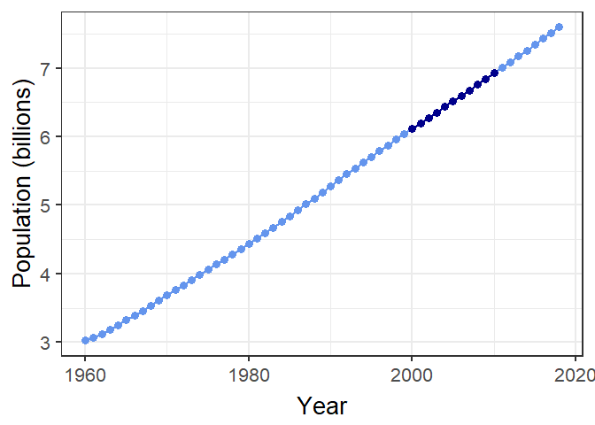

kayadata
========

**GitHub:** [](https://github.com/jonathan-g/kayadata/commits/master)

**GitLab:** [](https://gitlab.jgilligan.org/gilligan_teaching/ees_3310/ees_3310_software/kayadata/commits/master)

This package loads Kaya-identity data, synthesized from several sources.

To install and load the package, first install either the `pacman` or
`devtools` package from CRAN:

``` r
install.packages("devtools")
devtools::install_github("jonathan-g/kayadata")
library(kayadata)
```

or

``` r
install.packages("pacman")
library(pacman)
p_load_gh("jonathan-g/kayadata")
```

Once you’ve installed it, then you just need to use the command
`library(kayadata)` to load the package.

Some of the functions the package provides are:

-   `kaya_region_list()`: Get a list of available countries and regions.
-   `get_kaya_data()`: Get data for a specific country. Example:

``` r
mexico_data = get_kaya_data("Mexico") 
mexico_data %>% filter(year >= 1965) %>% 
  select(country:ef) %>%
  head()
```

    ## # A tibble: 6 x 10
    ##   country  year      P     G     E     F     g     e     f    ef
    ##   <ord>   <int>  <dbl> <dbl> <dbl> <dbl> <dbl> <dbl> <dbl> <dbl>
    ## 1 Mexico   1965 0.0446 0.207 0.991  62.1  4.64  4.79  62.7  300.
    ## 2 Mexico   1966 0.0460 0.220 1.05   65.0  4.77  4.78  62.0  296.
    ## 3 Mexico   1967 0.0474 0.233 1.07   66.6  4.90  4.59  62.4  287.
    ## 4 Mexico   1968 0.0489 0.254 1.16   72.2  5.20  4.57  62.1  284.
    ## 5 Mexico   1969 0.0504 0.263 1.28   79.1  5.22  4.86  61.9  301.
    ## 6 Mexico   1970 0.0520 0.280 1.36   84.2  5.39  4.86  61.8  300.

-   `project_top_down()`: Project future population, GDP, energy use,
    and emissions. Example:

``` r
mexico_2050 = project_top_down("Mexico", 2050)
mexico_2050
```

    ## # A tibble: 1 x 10
    ##   country  year     P     G     g     E     F     e     f    ef
    ##   <chr>   <dbl> <dbl> <dbl> <dbl> <dbl> <dbl> <dbl> <dbl> <dbl>
    ## 1 Mexico   2050 0.163  2.57  15.8  9.99  231.  3.88  23.1  89.7

-   `plot_kaya`: Plot trends in kaya variables for a given region or
    country. Example:
    
    
-   `get_fuel_mix`: Get the fuel mix (coal, gas, oil, nuclear, and
    renewables) for a region or country. Example:

``` r
mexico_mix = get_fuel_mix("Mexico")
mexico_mix
```

    ## # A tibble: 6 x 7
    ##   country country_code geography  year fuel         quads   pct
    ##   <chr>   <chr>        <chr>     <int> <ord>        <dbl> <dbl>
    ## 1 Mexico  MEX          nation     2017 Oil         3.44   45.8 
    ## 2 Mexico  MEX          nation     2017 Natural Gas 2.99   39.8 
    ## 3 Mexico  MEX          nation     2017 Coal        0.520   6.92
    ## 4 Mexico  MEX          nation     2017 Nuclear     0.0977  1.30
    ## 5 Mexico  MEX          nation     2017 Hydro       0.285   3.79
    ## 6 Mexico  MEX          nation     2017 Renewables  0.176   2.34

-   `plot_fuel_mix`: Plot the fuel mix in a donut chart

``` r
plot_fuel_mix(mexico_mix)
```


After you install the package, you can get more help inside RStudio by
typing `help(package="kayadata")` in the R console window.
