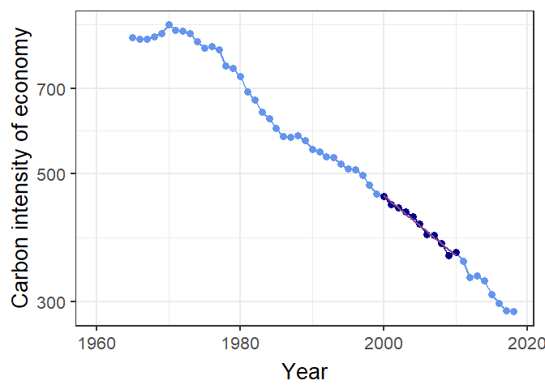
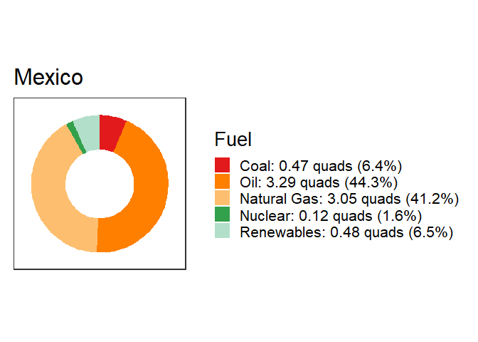

kayadata
========

[](https://cran.r-project.org/package=kayadata)

**GitHub:** [](https://github.com/jonathan-g/kayadata/commits/master)

**GitLab:** [](https://gitlab.jgilligan.org/gilligan_teaching/ees_3310/ees_3310_software/kayadata/commits/master)

This package loads Kaya-identity data, synthesized from several sources.

To install and load the package, first install either the `pacman` or
`devtools` package from CRAN:

``` r
install.packages("devtools")
devtools::install_github("jonathan-g/kayadata")
library(kayadata)
```

or

``` r
install.packages("pacman")
library(pacman)
p_load_gh("jonathan-g/kayadata")
```

Once you’ve installed it, then you just need to use the command
`library(kayadata)` to load the package.

Some of the functions the package provides are:

-   `kaya_region_list()`: Get a list of available countries and regions.
-   `get_kaya_data()`: Get data for a specific country. Example:

``` r
mexico_data = get_kaya_data("Mexico") 
mexico_data %>% filter(year >= 1965) %>% 
  select(region:ef) %>%
  head()
```

    ## # A tibble: 6 x 10
    ##   region  year      P     G     E     F     g     e     f    ef
    ##   <ord>  <int>  <dbl> <dbl> <dbl> <dbl> <dbl> <dbl> <dbl> <dbl>
    ## 1 Mexico  1965 0.0441 0.210 0.991  62.1  4.76  4.72  62.7  296.
    ## 2 Mexico  1966 0.0455 0.223 1.05   65.0  4.90  4.70  62.0  292.
    ## 3 Mexico  1967 0.0470 0.236 1.07   66.6  5.03  4.53  62.4  282.
    ## 4 Mexico  1968 0.0484 0.258 1.16   72.2  5.33  4.50  62.1  279.
    ## 5 Mexico  1969 0.0499 0.267 1.28   79.1  5.35  4.78  61.9  296.
    ## 6 Mexico  1970 0.0515 0.284 1.36   84.2  5.52  4.79  61.8  296.

-   `project_top_down()`: Project future population, GDP, energy use,
    and emissions. Example:

``` r
mexico_2050 = project_top_down("Mexico", 2050)
mexico_2050
```

    ## # A tibble: 1 x 10
    ##   region  year     P     G     g     E     F     e     f    ef
    ##   <chr>  <dbl> <dbl> <dbl> <dbl> <dbl> <dbl> <dbl> <dbl> <dbl>
    ## 1 Mexico  2050 0.163  2.57  15.8  9.99  581.  3.89  58.2  226.

-   `plot_kaya`: Plot trends in Kaya variables for a given region or
    country. Example:

``` r
us_kaya = get_kaya_data("United States")
plot_kaya(us_kaya, "ef", y_lab = "Carbon intensity of economy",
          start_year = 2000, stop_year = 2010, log_scale = TRUE,
          trend_line = TRUE)
```



``` r
world_kaya = get_kaya_data("World")
plot_kaya(world_kaya, "P", start_year = 2000, stop_year = 2010, log_scale = FALSE,
          trend_line = FALSE)
```

 \*
`get_fuel_mix`: Get the fuel mix (coal, gas, oil, nuclear, and
renewables) for a region or country. Example:

``` r
mexico_mix = get_fuel_mix("Mexico")
mexico_mix
```

    ## # A tibble: 5 x 5
    ##   region  year fuel        quads   frac
    ##   <chr>  <int> <ord>       <dbl>  <dbl>
    ## 1 Mexico  2018 Coal        0.472 0.0637
    ## 2 Mexico  2018 Oil         3.29  0.443 
    ## 3 Mexico  2018 Natural Gas 3.05  0.412 
    ## 4 Mexico  2018 Nuclear     0.122 0.0165
    ## 5 Mexico  2018 Renewables  0.483 0.0651

-   `plot_fuel_mix`: Plot the fuel mix in a donut chart

``` r
plot_fuel_mix(mexico_mix)
```



After you install the package, you can get more help inside RStudio by
typing `help(package="kayadata")` in the R console window.
